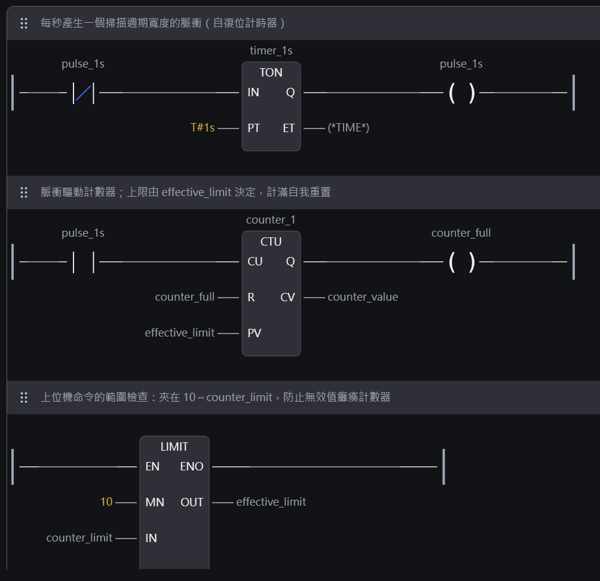
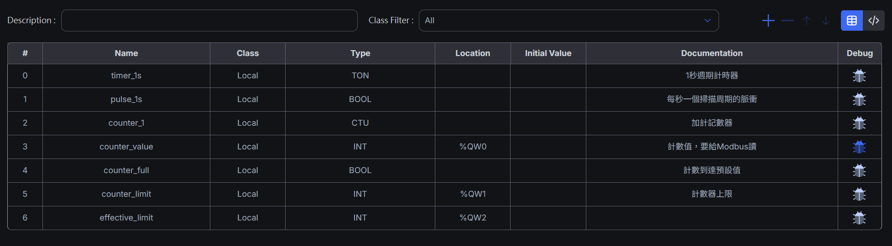
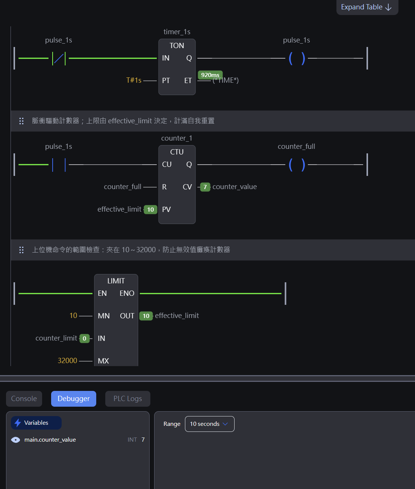
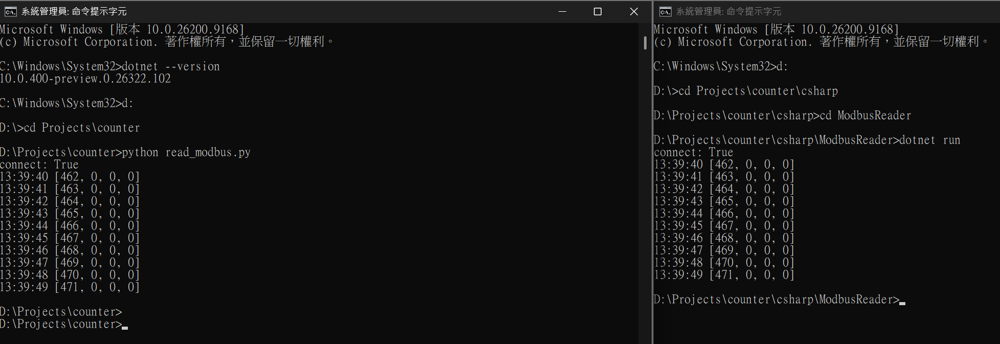
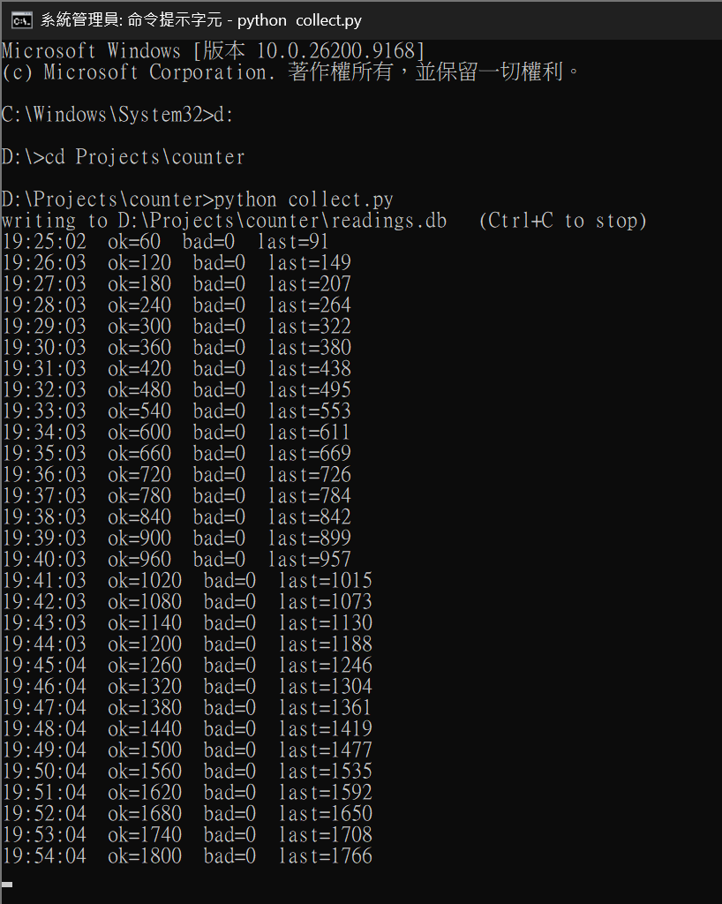
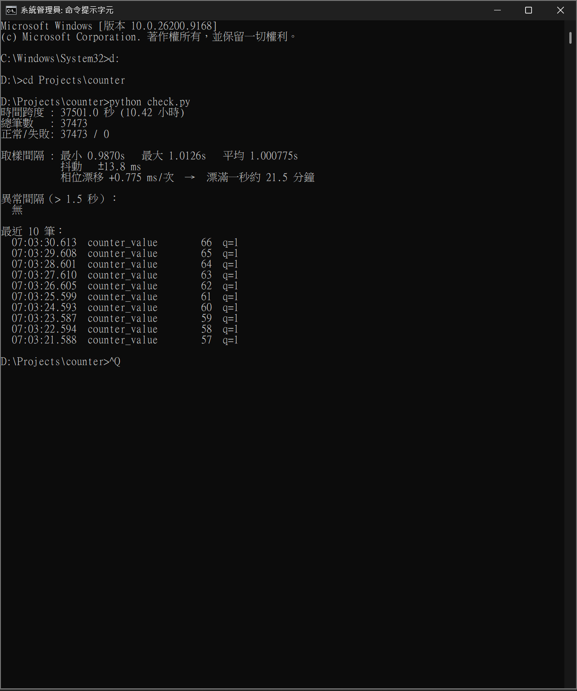
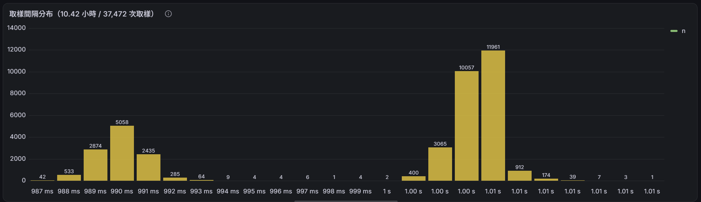
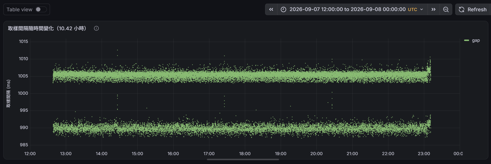

# PLC → Grafana：設備數據監測最小鏈路

從 PLC 到儀表板，把設備的值抓出來、存下來、畫出來，**並且能證明它是對的**。

雙向：上位機也能下命令，而**命令的合法範圍由 PLC 端決定**。

---

## 架構

```
┌──────────────────────────────┐
│  OpenPLC Runtime             │  梯形圖三段
│                              │
│  counter_value    %QW0  ───► │  PLC 現在數到幾
│  count_limit      %QW1  ◄─── │  上位機「要求」的上限
│  effective_limit  %QW2  ───► │  PLC「實際採用」的上限
└──────────┬───────────────────┘
           │  Modbus TCP  127.0.0.1:5020
     ┌─────┴──────┬──────────────┐
     │            │              │
┌────▼────┐  ┌────▼────┐   ┌─────▼──────┐
│ Python  │  │ C#      │   │ set_limit  │
│pymodbus │  │ NModbus │   │  下命令     │
│  讀     │  │  讀     │   │  寫        │
└────┬────┘  └─────────┘   └────────────┘
     │         ↑ 刻意的對照
┌────▼──────────┐
│ SQLite        │  readings.db
│ reading 表    │  ts / tag / value / quality
└────┬──────────┘
     │  只讀，不複製
┌────▼──────────┐
│ Grafana       │  儀表板定義以 JSON 進版控
│ 兩張圖        │  grafana/dashboard.json
└───────────────┘
```

---

## 目錄

```
.
├── README.md
├── pous/programs/main.ld             梯形圖原始檔（OpenPLC Editor 專案）
├── read_modbus.py                    一次性驗證：連得上嗎、讀得到嗎
├── collect.py                        常駐採集：讀 → 寫入 → 自我監測
├── check.py                          事後檢驗：跨度、筆數、間隔、抖動、相位漂移
├── probe.py                          位址探測：哪些 Modbus 位址讀得到
├── write_test.py                     位址探測：寫進去留不留得住
├── set_limit.py                      下命令：寫入上限、讀回 PLC 實際採用值
├── timer_test.py                     隔離測試：拿掉 Modbus 與 SQLite 的純計時迴圈
├── csharp/ModbusReader/
│   └── Program.cs                    C# 對照版，與 read_modbus.py 逐行等價
├── grafana/
│   └── dashboard.json                儀表板定義（設定即程式碼）
├── sample/
│   └── readings_demo.db              展示資料：10.42 小時、37,473 筆
└── docs/                             截圖
```

**`sample/readings_demo.db` 是固定的展示資料**，讓 clone 下來的人不用自己跑十小時就能重現那兩張圖。工作用的 `readings.db` 不進版控。

---

## 梯形圖



| Rung | 做什麼 |
|---|---|
| 1 | 每秒產生一個掃描週期寬度的脈衝（自復位計時器） |
| 2 | 脈衝驅動計數器；上限由 `effective_limit` 決定，計滿自我重置 |
| 3 | **上位機命令的範圍檢查**：`LIMIT` 把值夾在 10～32000 |

### 變數與 Modbus 對應



| 變數 | 型別 | Location | 誰在寫 |
|---|---|---|---|
| `counter_value` | INT | `%QW0` | PLC |
| **`count_limit`** | INT | **`%QW1`** | **上位機** |
| **`effective_limit`** | INT | **`%QW2`** | **PLC** |

**位址的「方向」不是通訊協定決定的，是 PLC 程式決定的。** Modbus 允許你寫，不代表 PLC 會讓那個值活著。

### 執行中



### 三支 Python 程式為什麼要分開

`read_modbus.py` **刻意不與 `collect.py` 共用任何模組**。

它是一個獨立的參考點：採集出問題時，用它可以判斷問題在**設備端**還是**採集端**。共用模組的話，兩支會一起壞，就失去比對的意義。

`check.py` 是事後檢驗，採集進行中可以隨時在另一個終端機執行，不影響 `collect.py`。

---

## 怎麼跑

### 前置條件

| 條件 | 怎麼確認 |
|---|---|
| OpenPLC Runtime 執行中 | 見下方 port 檢查 |
| **OpenPLC Editor 必須關閉** | Editor 一連上 Runtime 就會把 modbus_slave 停用 |
| port 5020 監聽中 | `netstat -an \| findstr LISTENING \| findstr ":5020"` |

要看到：

```
TCP    0.0.0.0:5020    0.0.0.0:0    LISTENING
```

> **注意**：OpenPLC 的 Modbus port 是 **5020**，不是標準的 502。
> 這是為了避開 Linux 上 1024 以下 port 需要 root 權限的限制。

### Python

```bash
pip install pymodbus          # 實測版本 3.15.0
python read_modbus.py         # 讀十筆
python collect.py             # 常駐採集，Ctrl+C 停止
python check.py               # 檢驗資料庫
python set_limit.py 500       # 下命令：把計數上限改成 500
```

### C#

```bash
cd csharp/ModbusReader
dotnet run                    # 讀十筆
```

依賴宣告在 `ModbusReader.csproj` 裡（NModbus 3.0.83），`dotnet run` 會自動還原。

---

## 驗收：兩個語言，同一個數字



兩個終端機同時執行，時間戳對齊、數值完全相同：

```
Python — read_modbus.py            C# — dotnet run
connect: True                      connect: True
13:39:40 [462, 0, 0, 0]            13:39:40 [462, 0, 0, 0]
13:39:41 [463, 0, 0, 0]            13:39:41 [463, 0, 0, 0]
13:39:42 [464, 0, 0, 0]            13:39:42 [464, 0, 0, 0]
13:39:43 [465, 0, 0, 0]            13:39:43 [465, 0, 0, 0]
13:39:44 [466, 0, 0, 0]            13:39:44 [466, 0, 0, 0]
13:39:45 [467, 0, 0, 0]            13:39:45 [467, 0, 0, 0]
13:39:46 [468, 0, 0, 0]            13:39:46 [468, 0, 0, 0]
13:39:47 [469, 0, 0, 0]            13:39:47 [469, 0, 0, 0]
13:39:48 [470, 0, 0, 0]            13:39:48 [470, 0, 0, 0]
13:39:49 [471, 0, 0, 0]            13:39:49 [471, 0, 0, 0]
```

第一個數字是 `counter_value`（`%QW0`），其餘三個是未使用的暫存器。

**兩支程式同時連上同一個 slave**——Modbus TCP 允許多個 client 並行讀取，這也順帶驗證了採集端可以在不干擾既有連線的情況下加入。

---

## 逐行對照

兩支程式是刻意逐行對應寫的。

| 做什麼 | Python（pymodbus） | C#（NModbus） |
|---|---|---|
| 建連線 | `ModbusTcpClient(host, port=5020)` | `new TcpClient()` + `Connect()` |
| 建 Modbus 層 | 內建在 client 物件裡 | `new ModbusFactory().CreateMaster(client)` |
| slave id | 預設 `1`，可不寫 | **必須明寫** `SLAVE = 1` |
| 讀暫存器 | `read_holding_registers(address=0, count=4)` | `ReadHoldingRegisters(SLAVE, 0, 4)` |
| 逾時 | `timeout=0.5`（秒） | `Transport.ReadTimeout = 500`（毫秒） |
| 錯誤處理 | `r.isError()` — **回傳值** | `try / catch` — **擲出例外** |
| 關閉連線 | `client.close()` | `using var` — 離開範圍自動關 |
| 依賴宣告 | `requirements.txt`（環境層級） | `.csproj`（專案層級） |

### 三個值得記的差異

**1. NModbus 把「TCP 連線」和「Modbus 協定」拆成兩個物件，pymodbus 揉成一個。**

拆開的代價是多寫一行，好處是同一個 master 可以掛 TCP、RTU、UDP 不同的 transport。對 gateway 來說這是對的抽象——**同一套採集邏輯，底下接不同協定的設備**。

**2. pymodbus 用回傳值報錯，NModbus 用例外報錯。**

這不是誰對誰錯，是兩個語言的慣例。但有實務後果：**`isError()` 你可以忘記檢查，例外你不能忘記接。** 前者會安靜地把錯誤資料寫進資料庫，後者會直接把程式打掛。

在採集程式裡，**「安靜地寫錯」比「直接掛掉」危險得多**——這正是 `quality` 欄位存在的理由。

**3. C# 沒有虛擬環境的概念，因為依賴是專案層級的。**

`dotnet add package` 直接改寫 `.csproj`，依賴跟著專案走。Python 是裝進環境，靠 `requirements.txt` 另外記錄。

---

## 資料庫

```sql
CREATE TABLE IF NOT EXISTS reading (
    ts      REAL    NOT NULL,   -- Unix 秒（UTC），保留小數
    tag     TEXT    NOT NULL,
    value   REAL    NOT NULL,
    quality INTEGER NOT NULL    -- 0 = 讀取失敗，1 = 正常
);
CREATE INDEX IF NOT EXISTS idx_reading_tag_ts ON reading(tag, ts);
```

### `ts` 為什麼是 REAL 而不是 INTEGER

**因為取樣週期不是整數秒。**

實測迴圈週期是 **1.000775 秒**。時間戳若寫成 `int(time.time())`，小數被無條件捨去，取樣相位每次前移 0.775 ms，**約 21.5 分鐘就累積漂滿一整秒**。越過整數秒邊界的那幾次，±13.8 ms 的抖動會讓相鄰兩筆共用同一個標籤，或跳過一個標籤。

看起來像週期性的資料遺失，實際上**一筆都沒掉，是標籤在打架**。

> 這不是這支程式特有的 bug。**任何取樣週期不是整數秒的系統，長時間運行後都會出現這個現象。**

### `quality` 為什麼不能省

讀取失敗會寫入 `value = 0.0, quality = 0`。

**讀取失敗跟真的讀到 0 是完全不同的事**，混在一起之後就分不出來。後續要算變化率時，一筆「讀不到」被當成「數值暴跌」，會產生最糟的那種誤報。

---

## 連續運行驗收





```
時間跨度 : 37501.0 秒 (10.42 小時)
總筆數   : 37473
正常/失敗: 37473 / 0
取樣間隔 : 最小 0.9870s   最大 1.0126s   平均 1.000775s
           抖動   ±13.8 ms
           相位漂移 +0.775 ms/次
異常間隔（> 1.5 秒）：無
```

**算術自我檢查**：`37,472 個間隔 × 1.000775 秒 = 37,501.0 秒`，與時間跨度完全吻合。

這個等式成立就等於證明沒有掉資料——**若中間漏掉任何一筆，間隔數會少一個而總跨度不變，等式必然對不上。**

### 斷線注入測試

手動停掉 Runtime 再重啟：

- 斷線期間存下 6 筆 `quality = 0`，**節奏維持 0.99–1.01 秒**（`timeout=0.5` 生效）
- Runtime 回來後自動重連，不需重啟採集程式
- **啟動順序無關**：先開 `collect.py` 再開 Runtime 也接得住

最後一項是 gateway 該有的性質——**採集端不依賴設備端先就位。**

---

## 視覺化（Grafana）

### 怎麼裝

1. Grafana OSS（實測 13.2.1），Windows 安裝檔，裝完是 Windows 服務，管理介面在 `http://localhost:3000`（**http，不是 https**），首次登入 `admin` / `admin`
2. 裝 SQLite 資料源外掛：

```
cd "C:\Program Files\GrafanaLabs\grafana\bin"
grafana-cli plugins install frser-sqlite-datasource
net stop Grafana && net start Grafana
```

**必須重啟服務**——這個外掛有 backend 元件，不重啟的症狀是「裝好了但選單裡找不到 SQLite」。

3. `Connections` → `Data sources` → SQLite，`Path` 填 `readings.db` 的完整路徑
4. `Dashboards` → `Import` → 貼上 `grafana/dashboard.json`，選剛建立的資料源

### 兩張圖

| 面板 | 查詢 | 看什麼 |
|---|---|---|
| 取樣間隔分布 | `GROUP BY ROUND(gap*1000)` | 每個間隔值出現幾次 |
| 取樣間隔隨時間變化 | `ts - LAG(ts) OVER (ORDER BY ts)` | 間隔在 10.4 小時內怎麼變 |

**第一張圖畫的是「間隔」，不是「值」。** 這是刻意的：畫值只會得到一條斜直線，證明資料存在；**畫間隔才能證明資料可信**。

### 三個踩坑

**1. 時間欄的單位是「秒」，不是毫秒。**

Grafana 內建 SQL 資料源的慣例是毫秒，**這個外掛不是**。寫成 `ts * 1000` 的後果是圖畫出來、不報錯、時間軸顯示 1952 年。

> **時間軸出錯通常不會報錯，只會安靜地畫錯。** 值錯了有 `quality` 欄可以標記，時間錯了沒有任何機制會告訴你。

**2. `Format as` 要跟查詢的形狀一致。**

`Time series` 需要一個時間欄；直方圖那種只有兩個數字欄的查詢必須改成 `Table`，否則報 `can not convert to wide series`。

**3. `Max data points` 預設會降採樣。**

Grafana 會把資料點壓到跟螢幕寬度差不多，也就是把幾十筆平均成一筆。**看趨勢時是體貼，看抖動時是破壞。** 要看分布必須手動調高（本專案設 50000）。

### 為什麼儀表板要進版控

`dashboard.json` 是儀表板的完整定義：有幾張圖、每張跑什麼 SQL、畫成點還是線、`Max data points` 設多少。

- **搬家**：換一台機器 import 就長回來，不用重拉滑鼠
- **版控**：純文字，改了什麼看 diff 就知道
- **交付**：文件附這個檔，讀者得到跟作者一模一樣的畫面

**一台 gateway 可以用滑鼠設定，五十台不行。**

> ⚠️ Grafana 13 匯出的是 `dashboard.grafana.app/v2` schema，**舊版 Grafana 可能無法匯入**。跨機器部署前先確認版本，或選 classic/v1 格式匯出。

---

## 一個摘要統計看不見的東西





把上面那 37,473 筆畫成圖之後，發現了 `check.py` 跑了四天沒看見的事。

`check.py` 報告的是：

```
取樣間隔 : 平均 1.000775s   抖動 ±13.8 ms
```

讀起來像「集中在 1.0008 秒附近上下抖動」。**實際的分布是兩個族群：**

- 約 **30%** 落在 **990 ms**
- 約 **70%** 落在 **1006 ms**
- 兩者相距 **16 ms**，中間 **1001–1002 ms 一筆都沒有**
- 兩條帶在 10.42 小時**全程並存**，不是分段交替

加權平均 `0.30 × 990 + 0.70 × 1005.5 ≈ 1000.85 ms`——**與報告的平均值吻合**。

**所以那個平均值算得完全正確。它只是描述了一個在 37,472 次取樣中只發生過 2 次的值。**

> **摘要統計看不見分布的形狀。** 平均值假設只有一個族群；當實際上有兩個，它會回報一個從未發生過的中間值，而且不會有任何警告。

成因未解。已用隔離測試排除迴圈節奏、`time.sleep`、時鐘精度、系統排程 tick；僅剩 Modbus 讀取與 SQLite 寫入兩個候選。`timer_test.py` 是那些測試用的程式。

**這件事直接影響後續設計**：任何依賴取樣間隔的計算（變化率、持續時間）**必須用資料庫裡的 `ts` 相減，不可假設等於 1.0 秒**。

---

## 雙向：上位機下命令，PLC 決定要不要採信

前面所有東西都是**唯讀**的——程式只是旁聽，不在控制鏈上。這一段是唯一會改變 PLC 行為的。

### 先探測，不猜

`probe.py` 找出哪些 Modbus 位址讀得到，`write_test.py` 找出寫進去留不留得住：

```
addr     1 : 寫入 ok    立刻讀= 4321   2 秒後= 4321     ✅ 留得住
addr   100 : 寫入 ok    立刻讀= 4321   2 秒後= 4321     ✅ 留得住
addr  1024 : 寫入 ok    立刻讀=    0   2 秒後=    0     ❌ 回報成功，值卻沒進去
```

**「兩秒後再讀一次」是必要的**——PLC 每 20 ms 掃描一次，如果那個位址是 PLC 的輸出，寫進去的值會在下一個掃描週期被蓋掉。兩秒 ≈ 100 個掃描週期，撐過就不是僥倖。

**位址 1024 那一列是重點**：Modbus 回應「寫入成功」，值根本沒存進去。**協定層說「我收到了」，跟系統說「我做了」，是兩件事。**

### 把 PV 接上外部變數之後，PLC 癱瘓了

第一版把 CTU 的 `PV` 直接接 `count_limit`。開機讀到十行 **0**：

```
10:29:13 [0, 0, 0, 0]
10:29:14 [0, 0, 0, 0]
   ⋮
```

`count_limit` 開機是 0 → `CV >= PV` 立刻成立 → `Q` → 回授到 `R` → **每個掃描週期重置一次，每秒被歸零五十次。**

**一台原本能自己運作的 PLC，被改成沒有上位機就癱瘓的機器。**

> 不是因為技術上做不到遠端控制——五分鐘就做到了。
> **是因為做到之後，就多了一個會讓產線停擺的單點故障。**

### 解法：命令的合法範圍寫在梯形圖裡

第三段 rung 的 `LIMIT(MN := 10, IN := count_limit, MX := 32000)`：

| 上位機寫入 | PLC 實際使用 | 實測 |
|---|---|---|
| 沒寫（開機 = 0） | 10 | ✅ 自己會動 |
| 500 | 500 | ✅ |
| **0** | **10** | ✅ 不癱瘓 |
| **40000**（超出 INT 上限） | **10** | ✅ 沒亂跑 |

**擋在哪裡，比擋不擋得住更重要：**

| 擋在 | 換一個上位機 | 網路斷了 | 上位機當機 |
|---|---|---|---|
| Python 端 | ❌ 沒了 | ❌ 沒了 | ❌ 沒了 |
| **梯形圖裡** | ✅ 還在 | ✅ 還在 | ✅ 還在 |

### 命令與回饋要成對

加上 `LIMIT` 之後，如果上位機讀回**自己剛寫進去的那個格子**：

```
寫入 40000 : ok
讀回  : 40000        ← 看起來完全成功，而 PLC 根本沒採用
```

**上位機無從得知自己的命令被拒絕了。**

所以命令介面是兩個位址，不是一個：

```
python set_limit.py 40000
寫入 40000 : ok
讀回  : 10            ← 讀的是 %QW2（PLC 實際採用），不是 %QW1（自己寫的）

python read_modbus.py
11:27:18 [0, 40000, 10, 0]
          ↑     ↑     ↑
       數到幾   要求   實際採用
```

**一次讀取就看得到命令和回饋，而且它們不一樣。**

> 這是「能下命令」和「能確認命令有沒有被接受」的分界。

### 40000 和 -25536 是同一組 16 個位元

| | 型別 | 看到的值 |
|---|---|---|
| Modbus 暫存器 | 16 bit **無號** | `40000` |
| PLC 的 `INT` | 16 bit **有號** | **`-25536`** |

沒有任何轉換發生，同樣的位元、兩種解讀。`LIMIT` 擋下的其實是一個負數，不是四萬。

**型別不是格式，是「這串位元要怎麼讀」的約定。** 兩邊約定不一致，資料不會報錯，只會被讀成別的東西。

---

## 為什麼刻意用兩個語言寫同一件事

不是為了展示會兩種語言，是為了**讓差異浮出來**。

一個人只用過一套函式庫的時候，會分不清哪些是「Modbus 協定的規定」、哪些只是「這套函式庫幫你做的決定」。

寫第二遍的時候才會發現：slave id 是協定的一部分（pymodbus 幫你填了預設值），而「錯誤用回傳值還是用例外」完全是語言慣例、跟協定無關。

**這條鏈路我兩種語言都寫過，差別在哪我知道。**

---

## 刻意不做的事

- ❌ C# 端的完整 HMI 介面（WinForms／WPF）
- ❌ 用 C# 重寫整條鏈路
- ❌ 把 C# 版做成常駐採集
- ❌ 機器學習、異常偵測模型
- ❌ 使用者登入、權限管理

C# 端**只做讀取那一段的對照**。範圍是刻意限制的——要換到的是「語言不是障礙」這件事，而那件事三十行就講完了。再往下做，每一項都要花時間，但沒有一項會改變這個結論。

**知道在哪裡停，跟知道怎麼做，是兩種不同的能力。**

---

## 還沒做的

| 項目 | 狀態 |
|---|---|
| 搬上樹莓派，跨越真實網路讀寫 | 硬體待到貨 |
| MQTT 上送到雲端 broker（Edge-to-Cloud） | 規劃中 |
| 三層告警規則（絕對值／變化率／持續時間），跑在 edge 端 | 規劃中 |

**目前的雙向讀寫走 `127.0.0.1`，還沒真的跨過網路。** 那是下一階段的事。

---

## 環境

| 項目 | 版本 |
|---|---|
| OpenPLC Editor | 4.2.11 |
| OpenPLC Runtime | 4.2.1 |
| Python | pymodbus 3.15.0 |
| .NET SDK | 10.0.400-preview |
| NModbus | 3.0.83 |
| Grafana | OSS 13.2.1 |
| SQLite 資料源外掛 | frser-sqlite-datasource 4.0.6 |
| OS | Windows 11 |

### Runtime 的兩處出廠設定必須手改

| 檔案 | 改什麼 | 為什麼 |
|---|---|---|
| `plugins.conf` | `modbus_slave` 的 enabled 欄 `0` → `1` | 出廠預設停用 |
| `simple_modbus.py`（約第 982 行） | `gIp` → `"0.0.0.0"` | 出廠值是安裝當下機器的 IP，換網路就綁不上 |

**`plugins.conf` 的修改會被 Editor 無聲覆蓋**——Editor 一連上 Runtime 就會推送它自己的外掛設定。改這個檔之前必須先關掉 Editor。

### 執行時的注意事項

- **關掉 Windows 主控台的「快速編輯模式」**。在終端機視窗裡用滑鼠選取文字會把程序整個暫停——實測造成過一次 66 秒的停擺。
- **用 `python collect.py` 執行，不要只打 `collect.py`**。副檔名關聯會把它開進編輯器而不是執行它。
