# 設備資料能不能信？

從 PLC 到儀表板的最小資料鏈路——**重點不在接得起來，在證明接到的資料是對的。**

`OpenPLC` `Modbus TCP` `Modbus RTU` `RS-485` `Python` `C#` `SQLite` `TOML` `Grafana` `IEC 61131-3`

---

## 問題

設備聯網的專案通常停在「**接上了**」。

值跑出來了、圖畫出來了、示範看起來很順——然後就結案。**很少有人回答下一個問題：這些資料能不能拿來做判斷？**

而在產線上，這個問題才是真的：

- 資料有沒有掉？**掉的時候沒有人在看。**
- 時間戳準不準？**值錯了可以標記，時間錯了沒有任何機制會告訴你。**
- 讀取失敗和讀到 0，在資料庫裡長得一樣嗎？

**這個專案用一條最小的鏈路，把力氣全部花在驗證上。**

結果是：光是「一秒採樣一筆」這麼簡單的事，**就找到四個會安靜騙你的地方**——而且每一個都不會報錯。

---

## 四個發現

### 1. 追了四天的「資料遺失」，一筆都沒遺失過

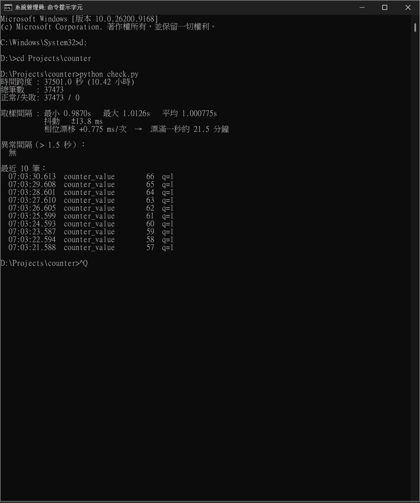

早期版本用 `int(time.time())` 存整數秒。檢驗程式報告「某些秒沒資料、某些秒有兩筆」，**每隔約 20 分鐘爆發一次**，週期性得可疑。

排除了磁碟、電源模式、CPU 降頻、迴圈延遲——**全部不是。**

**真正的原因**：迴圈實際週期是 **1.000775 秒**，不是 1.000 秒。小數被 `int()` 截掉之後，取樣相位每次前移 0.775 ms，**約 21.5 分鐘漂滿一整秒**。越過整數秒邊界的那幾次，±14 ms 的抖動就讓相鄰兩筆共用同一個標籤，或跳過一個標籤。

**資料一直是完整的。是標籤在打架。**

> 這不是這支程式特有的 bug。**任何取樣週期不是整數秒的系統，長時間運行後都會出現這個現象。**

修正是一個字：`ts INTEGER` → `ts REAL`。

---

### 2. 統計摘要是對的，但它描述的東西不存在

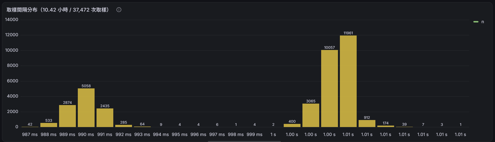

檢驗程式報告：

```
取樣間隔 : 平均 1.000775s   抖動 ±13.8 ms
```

讀起來像「集中在 1.0008 秒附近上下抖動」。**把同一批資料畫成圖之後，真相完全不同：**

- 約 **30%** 落在 **990 ms**
- 約 **70%** 落在 **1006 ms**
- 兩者相距 **16 ms**，中間 **1001–1002 ms 一筆都沒有**

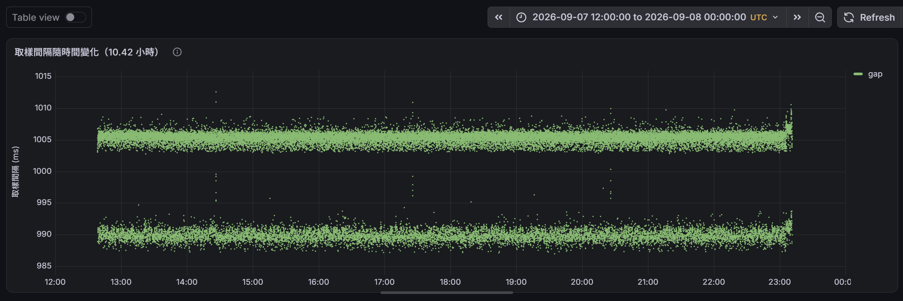

加權平均 `0.30 × 990 + 0.70 × 1005.5 ≈ 1000.85 ms`——**與報告的平均值吻合。**

**所以那個平均值算得完全正確。它只是描述了一個在 37,472 次取樣中只發生過 2 次的值。**

> **摘要統計看不見分布的形狀。**
> 平均值假設只有一個族群；當實際上有兩個，它會回報一個從未發生過的中間值——**而且不會有任何警告。**

**直接的設計後果**：任何依賴取樣間隔的計算（變化率、持續時間），**必須用資料庫裡的時間戳相減，不可假設等於 1.0 秒**。告警門檻也不能只看平均值加減標準差——**那會設在兩群之間的真空帶，永遠不觸發，而且看起來完全合理。**

---

### 3.「寫入成功」不等於「命令被接受」

上位機寫入一個超出範圍的值，PLC 端的範圍檢查把它擋掉了。但如果上位機讀回**自己剛寫進去的那個位址**：

```
寫入 40000 : ok
讀回  : 40000        ← 看起來完全成功，而 PLC 根本沒採用
```

**上位機無從得知命令被拒絕了。** 在真實產線上，這是操作員以為機器已經照新參數在跑的那種情境。

**解法是命令與回饋成對**——兩個位址，不是一個：

```
11:27:18 [0, 40000, 10, 0]
          ↑     ↑     ↑
    現在數到  要求   PLC 實際採用
```

**一次讀取就看得到命令和回饋，而且它們不一樣。**

而那個範圍檢查是寫在**梯形圖裡**，不是寫在 Python 裡：

| 擋在 | 換一個上位機 | 網路斷了 | 上位機當機 |
|---|---|---|---|
| Python 端 | ❌ 沒了 | ❌ 沒了 | ❌ 沒了 |
| **梯形圖裡** | ✅ 還在 | ✅ 還在 | ✅ 還在 |

---

### 4. 為了誠實而設計的欄位，有一個它誠實不到的地方

`quality` 這個欄位的存在理由寫在下面的「資料表設計」：**讀取失敗要留下 `value=0.0, quality=0`，才不會跟「真的讀到 0」混在一起。** 這個設計是對的，而且運作得很好。

然後 14.8 小時的雙來源長跑給了它一個反例。

**驗收數字全部漂亮**：

```
涵蓋 2026-09-30 16:12:38 – 10-01 07:00:54   14.80 小時
counter_value  53,281 筆   失敗 0
xymd02_temp    53,281 筆   失敗 0
xymd02_humi    53,281 筆   失敗 0
總計          159,843 筆   失敗率 0.0000%
```

**但時間跨度是 53,295 秒，1 Hz 應該要有 53,296 筆。少了 15 輪。**

這 15 輪在資料庫裡**不是 15 筆 `quality=0`，是什麼都沒有**。零失敗率是真的——因為那幾輪根本沒去讀，自然也沒有失敗可記。

日誌指出了位置。4 次 `LOOP LATE` 全部擠在 **12 秒之內**：

```
01:35:37  LOOP LATE: 週期=5.512s    SLOW  read=62ms   write=4443ms
01:35:40  LOOP LATE: 週期=2.162s    SLOW  read=62ms   write=1091ms
01:35:43  LOOP LATE: 週期=2.944s    SLOW  read=62ms   write=1873ms
01:35:49  LOOP LATE: 週期=9.236s    SLOW  read=62ms   write=8170ms
```

`read` 全程 62 ms，正常。**慢的是 `write`——最慢一次 8,170 毫秒。** 迴圈用「目標時刻減現在」來睡，寫入超過一秒時 `sleep()` 收到負數變成 0，直接衝進下一輪。那幾輪**從來沒有發生過**。

| 狀況 | 資料庫裡長什麼樣 | 事後查得出來嗎 |
|---|---|---|
| 真的讀到 0 | `value=0, quality=1` | ✅ |
| 去讀了，但讀不到 | `value=0, quality=0` | ✅ |
| **根本沒去讀** | **一列都沒有** | ❌ 只能靠相鄰時間戳相減推算 |

> **`quality` 抓得到「我去讀了但讀不到」，抓不到「我根本沒去讀」。**
> 一個為了不讓資料說謊而設計的欄位，在採集程式自己卡住的時候是沉默的。

**這跟「獨立的程式不等於獨立的假設」是同一類問題**：保護機制涵蓋的是設計者想得到的失效模式，而它想不到的那些，看起來跟「一切正常」完全一樣。

修正方向已經確定（列入下一階段）：迴圈偵測到跳過了 N 輪時，**為那 N 秒補上 `quality=0` 的列**，讓「沒去讀」跟「讀不到」一樣留得下痕跡。

---

## 這條鏈路

```
   筆電                                   XY-MD02 溫溼度計
┌────────────────────┐               ┌────────────────────┐
│ OpenPLC Runtime    │               │ 溫度  0x0001       │
│ counter_value %QW0 │               │ 濕度  0x0002       │
│ count_limit   %QW1 │               │ 從站位址 1         │
│ effective_lim %QW2 │               └─────────┬──────────┘
└─────────┬──────────┘                         │
          │ Modbus TCP :5020        Modbus RTU over RS-485
          │ 乙太網路直連               9600 8N1、半雙工
          │                                    │
          │                         ┌──────────┴──────────┐
          │                         │ USB 轉 RS-485       │
          │                         │ /dev/ttyUSB0        │
          │                         └──────────┬──────────┘
          └───────────────┬────────────────────┘
                          │
          ┌───────────────▼─────────────────┐
          │  collect.py（樹莓派）            │
          │  一支程式、一個 1 Hz 節拍        │
          │  兩種實體層、三個 tag            │
          │  設備清單全在 devices.toml       │
          └───────────────┬─────────────────┘
                          │
           ┌──────────────▼───────────┐     ┌──────────────┐
           │ SQLite   readings.db     │────►│ Grafana      │
           └──────────────────────────┘ 只讀 │ 雙 Y 軸面板  │
                                             └──────────────┘

   另有三支不進採集主線的工具，刻意不共用任何模組：
     read_modbus.py / ModbusReader.cs   TCP 單次讀取（兩語言對照）
     read_rtu.py                        RTU 單次讀取
     set_limit.py                       寫入命令、讀回實際採用值
```

**驗收結果**：

| 平台與來源 | 時數 | 筆數 | 讀取失敗 |
|---|---|---|---|
| 筆電，Modbus TCP 單來源 | 10.42 h | 37,473 | 0 |
| 樹莓派，有線直連 | 8.06 h | 29,023 | 0 |
| **樹莓派，TCP + RTU 雙來源** | **14.80 h** | **159,843** | **0** |

前兩次的筆數與時間跨度在數學上互相印證：`37,472 個間隔 × 1.000775 秒 = 37,501.0 秒`，與實際跨度完全吻合——**若中間漏掉任何一筆，等式必然對不上。**

**第三次對不上**，差了 15 輪——那正是「發現 4」。**同一個等式，一次用來證明沒掉資料，一次用來找出掉在哪裡。**

---

## 為什麼用 OpenPLC，而不是 Beckhoff 或西門子

**常見的質疑**：OpenPLC 跑在 Windows 上，掃描週期 20 ms 而且不確定；商用即時 PLC 可以到微秒等級。**那這裡發現的問題，是不是只是工具太陽春？**

**這個質疑對一半。工具差距是真的，但四個發現沒有一個跟掃描週期有關。**

| 發現 | 發生在哪一層 | 換成商用 PLC 會消失嗎 |
|---|---|---|
| `int()` 截斷造成的假性資料遺失 | **採集端的時間戳** | ❌ 純算術，完全不會 |
| 雙峰的取樣間隔 | **採集程式所在的作業系統**（已用隔離測試證實與 PLC 無關） | ❌ 不會 |
| 「寫入成功 ≠ 命令被接受」 | **協定語意與架構設計** | ❌ 不會 |
| 跳過的輪次留不下痕跡 | **採集迴圈與資料表設計** | ❌ 不會 |

**四個全部發生在 gateway 端，不在 PLC 端。**

而 **gateway 端永遠不是即時系統**——不管下面接的是樹莓派還是 Beckhoff CX，它都是一台跑著通用作業系統、透過網路輪詢的普通電腦。

> **這正是控制邏輯要留在 PLC、中央只做監看的理由。**
> 上面那一層本來就不可靠——**而這個專案量出了它有多不可靠。**

**真正受工具影響的只有一件事**：本專案曾觀察到「一個文字編輯器啟動，就讓軟 PLC 掉了一拍」。**那條是軟 PLC 特有的，在即時核心上不會發生**，記錄時已標明。

**選型理由**：零成本、可重現、而且要驗證的東西不需要即時性。**先把資料可信度做對，再談確定性。**

---

## 這個專案不是什麼

- ❌ 不是一套可以上線的監控系統
- ❌ 不是機器學習或異常偵測模型
- ❌ 不是 C# 的完整 HMI（C# 只做讀取那一段的對照）

**範圍是刻意限制的。知道在哪裡停，跟知道怎麼做，是兩種不同的能力。**

---

## 怎麼跑

<details>
<summary><b>展開：安裝與執行步驟</b></summary>

### 前置條件

| 條件 | 怎麼確認 |
|---|---|
| OpenPLC Runtime 執行中 | 見下方 port 檢查 |
| **OpenPLC Editor 必須關閉** | Editor 一連上 Runtime 就會把 modbus_slave 停用 |
| port 5020 監聽中 | `netstat -an \| findstr LISTENING \| findstr ":5020"` |

要看到 `TCP 0.0.0.0:5020 ... LISTENING`。

> OpenPLC 的 Modbus port 是 **5020**，不是標準的 502——為了避開 Linux 上 1024 以下 port 需要 root 的限制。

### Python

**建虛擬環境、照 `requirements.txt` 安裝**（兩台機器都一樣，只有路徑寫法不同）：

```bash
# Windows
python -m venv .venv
.venv\Scripts\pip install -r requirements.txt

# Linux / 樹莓派
python3 -m venv .venv
.venv/bin/pip install -r requirements.txt
```

**執行**（以 Linux 路徑為例，Windows 換成 `.venv\Scripts\python`）：

```bash
.venv/bin/python read_modbus.py      # TCP 讀十筆
.venv/bin/python read_rtu.py         # RS-485 讀一次溫溼度
.venv/bin/python rtu_scan.py         # 掃匯流排：找鮑率、同位、從站位址
.venv/bin/python collect.py          # 常駐採集，Ctrl+C 停止
.venv/bin/python check.py            # 檢驗資料庫
.venv/bin/python set_limit.py 500    # 下命令：把計數上限改成 500
```

> **寫完整路徑而不是先 `activate`**，是因為終點是 systemd——service 檔只能寫絕對路徑。現在就一致，部署時不會有落差。

⚠️ **`collect.py` 服務跑著的時候，`read_rtu.py` 和 `rtu_scan.py` 會開不起來**，`connect()` 直接回 `False`。Linux 給序列埠獨占旗標，第二個程式開不了同一個 `/dev/ttyUSB0`。這不是限制，是**作業系統層級保證了一條 RS-485 匯流排上只有一個 master**——要用診斷工具就先 `sudo systemctl stop collect`。

### 設備清單寫在 devices.toml，不在程式裡

`collect.py` **不知道自己接了什麼**。設備、協定、暫存器位址、換算係數、逾時，全部在 `devices.toml`。

**驗收標準是一個 grep**：在 `collect.py` 裡找不到任何設備專屬字串——`192.168.50.1`、`xymd02`、`ttyUSB0`、`9600` 一個都不該出現。

```toml
[gateway]
interval = 1.0

[[device]]
name     = "plc"
protocol = "modbus_tcp"
host     = "192.168.50.1"      # ← PLC 那台的 IP，跨機器部署改這裡
port     = 5020
timeout  = 0.8
retries  = 0
reconnect_on_error = true      # TCP 要：死掉的連線物件會卡著不放

  [[device.tag]]
  name = "counter_value"
  function = 3                 # 0x03 保持暫存器
  address = 0

[[device]]
name      = "xymd02"
protocol  = "modbus_rtu"
port      = "/dev/ttyUSB0"
baudrate  = 9600
parity    = "N"
device_id = 1
timeout   = 0.3                # 實測單次交易 31 ms，給十倍餘裕
retries   = 0
reconnect_on_error = false     # RTU 不要：RS-485 無狀態，沒有連線可以半開

  [[device.tag]]
  name = "xymd02_temp"
  function = 4                 # 0x04 輸入暫存器
  address = 1
  scale = 0.1
  signed = true                # 低於 0 °C 是二補數，不轉會讀到 6548.6
```

**`reconnect_on_error` 是設備的屬性，不是程式的開關**——因為「要不要重連」的答案取決於下面那層是什麼協定。寫死在程式裡，就只能對其中一種是對的。

格式是 TOML。Python 3.11 起 `tomllib` 是標準函式庫，**不需要安裝任何套件**，而且支援註解——上面那些 `#` 後面的字，就是設定檔自己帶著的理由。

> 只有兩個東西仍走環境變數：`CONFIG_PATH` 和 `DB_PATH`。**`DB_PATH` 刻意不放進 `devices.toml`**，因為 `collect.service` 要在每次啟動時產生帶時間戳的檔名——「換一次設定就換一個資料庫」這個紀律必須留在服務層，不能讓人在組態裡改掉。

### 兩台機器的部署

| | 角色 | 跑什麼 |
|---|---|---|
| Windows 筆電 | **PLC** | OpenPLC Runtime |
| 樹莓派 | **Gateway** | 採集、SQLite、Grafana、RS-485 |

> **gateway 不是 PLC。** 它是放在 PLC 旁邊、透過網路讀寫它的另一台電腦——所以 PLC 那一端是可替換的：換成實體 PLC 時，gateway 這邊**連程式碼都不用改，只改 `devices.toml` 的 `host`**。

**跨機器時筆電端還要做兩件事**：

1. **Windows 防火牆放行 TCP 5020**
2. **確認該網路的類別不是 `Public`**——Windows 對 python 的封鎖規則預設只在 `Public` 生效，而 **Block 永遠贏過 Allow**。症狀是一個什麼都不說的 timeout

### C#

```bash
cd csharp/ModbusReader
dotnet run
```

依賴宣告在 `ModbusReader.csproj`（NModbus 3.0.83），`dotnet run` 會自動還原。

### Grafana

1. 裝 Grafana OSS（實測 13.2.1），介面在 `http://localhost:3000`（**http 不是 https**），首次登入 `admin` / `admin`
2. 裝 SQLite 資料源外掛並**重啟服務**：

```
cd "C:\Program Files\GrafanaLabs\grafana\bin"
grafana-cli plugins install frser-sqlite-datasource
net stop Grafana && net start Grafana
```

**不重啟的症狀是「裝好了但選單裡找不到 SQLite」**——這個外掛有 backend 元件。

3. `Connections` → `Data sources` → SQLite，`Path` 填 **`sample/readings_demo.db`** 的完整路徑
4. `Dashboards` → `Import` → 貼上 `grafana/dashboard.json`

**`sample/readings_demo.db` 是固定的展示資料**（10.42 小時、37,473 筆），不用自己跑十小時就能重現上面那兩張圖。

</details>

---

## 目錄

```
.
├── pous/programs/main.ld             梯形圖原始檔
├── devices.toml                      採集組態：接了什麼設備、讀哪些暫存器
├── collect.py                        常駐採集：讀 → 寫入 → 自我監測（組態驅動）
├── read_modbus.py                    一次性驗證（TCP）：連得上嗎、讀得到嗎
├── read_rtu.py                       一次性驗證（RTU）：失敗分三類並印出耗時
├── rtu_scan.py                       匯流排掃描：鮑率 × 同位 × 位址，找出不認識的從站
├── check.py                          事後檢驗：跨度、筆數、間隔、抖動、相位漂移
├── probe.py / write_test.py          位址探測：哪些位址讀得到、寫得進去
├── set_limit.py                      下命令：寫入上限、讀回實際採用值
├── timer_test.py                     隔離測試：拿掉 Modbus 與 SQLite 的純計時迴圈
├── modbus_sim.py                     本機對照組：只監聽 127.0.0.1 的 Modbus TCP 伺服器
├── rules_offline.py                  規則離線驗證：對既有資料庫跑 R1–R4
├── deploy/collect.service            systemd 服務定義（資料庫與日誌自動帶時間戳）
├── requirements.txt                  Python 依賴（版本鎖定）
├── csharp/ModbusReader/Program.cs    C# 對照版，與 read_modbus.py 逐行等價
├── grafana/dashboard.json            儀表板定義（設定即程式碼）
├── sample/readings_demo.db           展示資料：10.42 小時、37,473 筆
└── docs/                             截圖與手繪圖
```

### 為什麼分成三支獨立的 Python

`read_modbus.py` **刻意不與 `collect.py` 共用任何模組**——它是獨立的參考點，採集出問題時用它判斷問題在**設備端**還是**採集端**。共用模組的話兩支會一起壞，比對就失去意義。`read_rtu.py` 對 RS-485 那一支扮演同樣的角色。

> 但這個保護有極限：`collect.py` 與 `check.py` 是兩支不共用程式碼的程式，**卻內建了同一個錯誤假設**（「一秒一筆 = 每個整數秒一列」）。
> **獨立的程式，不等於獨立的假設。**

---

## 技術細節

<details>
<summary><b>梯形圖與 Modbus 對應</b></summary>

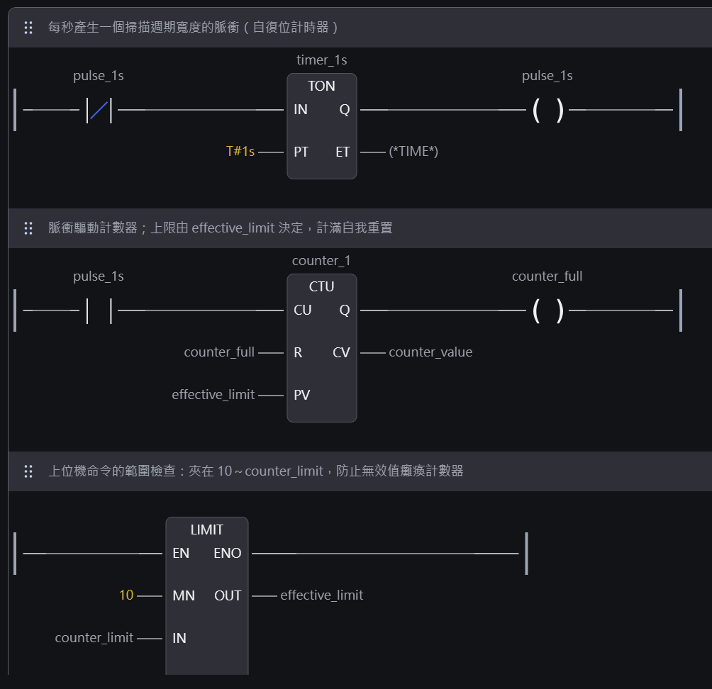

| Rung | 做什麼 |
|---|---|
| 1 | 每秒產生一個掃描週期寬度的脈衝（自復位計時器） |
| 2 | 脈衝驅動計數器；上限由 `effective_limit` 決定，計滿自我重置 |
| 3 | **上位機命令的範圍檢查**：`LIMIT` 把值夾在 10～32000 |

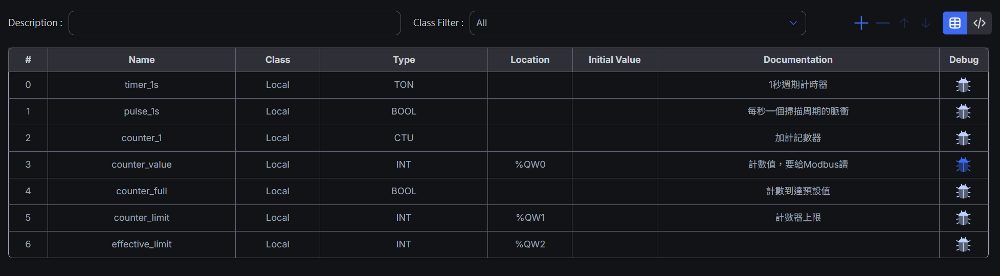

| 變數 | 型別 | Location | 誰在寫 |
|---|---|---|---|
| `counter_value` | INT | `%QW0` | PLC |
| **`count_limit`** | INT | **`%QW1`** | **上位機** |
| **`effective_limit`** | INT | **`%QW2`** | **PLC** |

**位址的「方向」不是通訊協定決定的，是 PLC 程式決定的。** Modbus 允許你寫，不代表 PLC 會讓那個值活著。

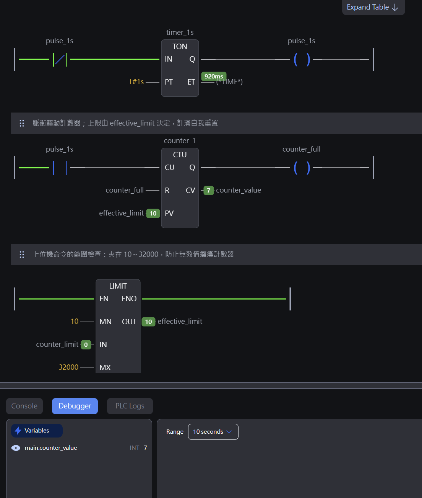

### `LIMIT` 是函式，不是功能塊

| | 例子 | 有沒有記憶 | 要不要取名字 |
|---|---|---|---|
| **函式** | `LIMIT` | 沒有 | 不用 |
| **功能塊** | `TON`、`CTU` | 有 | 要（`timer_1s`、`counter_1`） |

**分辨方法就是「要不要取名字」**——要記住東西的才要。

`EN` 也不是「供電」，是「**這一趟掃描要不要算**」。`EN = FALSE` 時 `OUT` 保持上一次的值，不是變成 0。

> **「沒有被執行的判斷」跟「判斷結果是沒事」，長得一模一樣。**

</details>

<details>
<summary><b>資料表設計：ts 為什麼是 REAL、quality 為什麼不能省</b></summary>

```sql
CREATE TABLE IF NOT EXISTS reading (
    ts      REAL    NOT NULL,   -- Unix 秒（UTC），保留小數
    tag     TEXT    NOT NULL,
    value   REAL    NOT NULL,
    quality INTEGER NOT NULL    -- 0 = 讀取失敗，1 = 正常
);
CREATE INDEX IF NOT EXISTS idx_reading_tag_ts ON reading(tag, ts);
```

**`ts REAL`** 的理由見「發現 1」。

⚠️ **`REAL` 在 SQLite 只是「親和性」，不是強制**——真正保留小數的是 Python 端不呼叫 `int()`。但搬到 MS SQL 這類中央資料庫時，欄位型別就是強制的，**宣告成 `INT` 會安靜地截斷**。

**`quality`**：讀取失敗會寫入 `value = 0.0, quality = 0`。

**讀取失敗跟真的讀到 0 是完全不同的事**，混在一起就永遠分不出來。算變化率時，一筆「讀不到」被當成「數值暴跌」，會產生最糟的那種誤報。

**原始資料要誠實**：不補值、不平滑、不跳過失敗。**資料一旦被動過，之後再也還原不回來**——下游永遠可以選擇忽略某些列，卻沒辦法把被刪掉的列變回來。

⚠️ **這張表有一件事記不住**：採集迴圈自己卡住而跳過的輪次。見「發現 4」。

### 多來源共用同一張表，不用改結構

RS-485 那一支接上來的時候，**資料表一個字都沒改**。

因為它本來就是長表（`tag` 是資料，不是欄位名），新增一個 tag 只是多一些列。如果當初設計成寬表——`counter_value`、`temp`、`humi` 各一欄——每加一顆感測器就要 `ALTER TABLE`，而歷史資料那幾欄全是 `NULL`。

> **長表在只有一個 tag 的時候看起來很蠢。它的價值在第二個 tag 出現的那一天才兌現。**

</details>

<details>
<summary><b>Modbus RTU over RS-485：第二種實體層</b></summary>

同一台 gateway、同一個 1 Hz 節拍，底下接兩種完全不同的實體層：

| | PLC | XY-MD02 溫溼度計 |
|---|---|---|
| 協定 | Modbus **TCP** | Modbus **RTU** |
| 實體層 | 乙太網路，全雙工 | RS-485，**半雙工** |
| 訊框 | MBAP 標頭 + PDU | 位址 + 功能碼 + 資料 + **CRC16** |
| 邊界靠什麼 | 封包長度欄 | **t3.5 字元的匯流排靜默** |
| 有沒有連線狀態 | 有（所以會半開） | **沒有** |
| 單次交易實測 | 約 5 ms | **31 ms** |

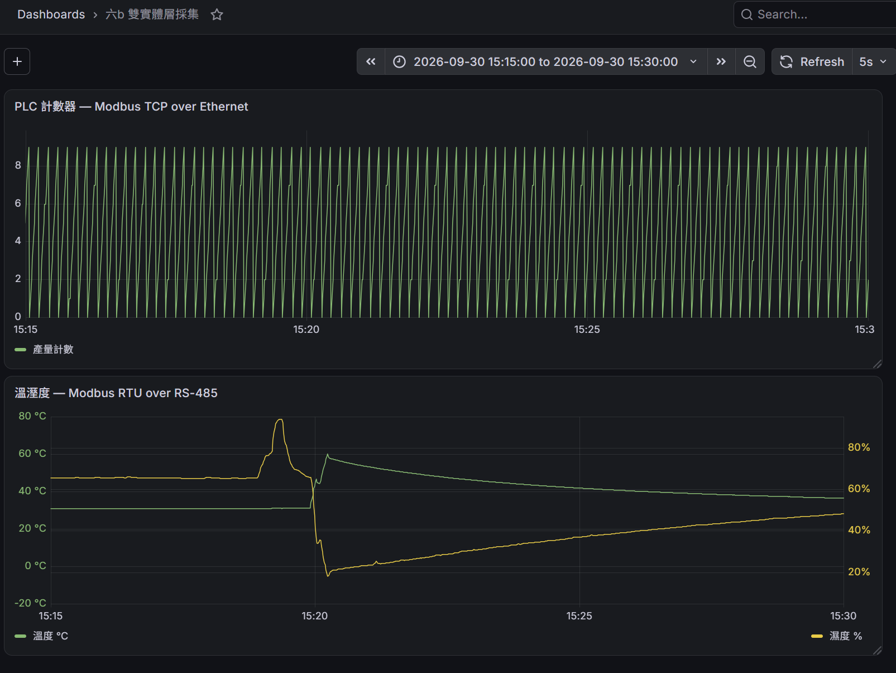

### 四種病因，一個症狀

RS-485 上「沒有回應」至少對應四種完全不同的原因，而**程式分辨不出是哪一種**：

| 真正的病因 | 程式看到的 |
|---|---|
| A/B 兩條線接反 | 逾時 |
| 從站位址錯 | 逾時 |
| 鮑率不對 | 逾時 |
| 從站沒電 | 逾時 |

這跟 TCP 很不一樣。TCP 至少會告訴你 `connection refused` 和 `timeout` 是兩回事。**RS-485 上這四種病，症狀一模一樣。**

分界線不在「哪裡壞了」，而在**從站有沒有開口**：

| 類別 | pymodbus 的行為 | 意義 |
|---|---|---|
| 序列埠打不開 | `connect()` 回 `False` | 沒插、沒權限、被佔用 |
| **從站完全沒回應** | **擲出 `ModbusIOException`** | 上面那四種，分不出來 |
| **從站回了錯誤回應** | **回傳 `ExceptionResponse`** | **整條物理鏈路是通的**，錯的是應用層參數 |

⚠️ **這兩種失敗的形式不一樣**：一個要用 `try/except` 接，一個要用 `isError()` 判斷。**只寫其中一種，另一種會讓採集程式整個掛掉。** 第一次做故障注入時就是這樣被 traceback 殺掉的，連耗時都沒印出來。

> 所以「**收到任何回應，包括拒絕**」是個好消息——它證明線接對了、位址對了、鮑率對了、電也有。
> **一個格式正確的錯誤回應，比沉默有價值得多。**

症狀分不出來，就只能照成本由低到高逐一排除：

```
1. 三用電表量 V+ 對 V−          排除沒電         十秒
2. 執行 rtu_scan.py             排除鮑率、位址    兩分鐘
3. 對調 A/B 再跑一次            排除極性反接      一分鐘
4. 以上都不行                   線斷了或從站壞了
```

### rtu_scan.py 能不能用，完全由 timeout 決定

掃 3 種鮑率 × 247 個位址 = 741 次嘗試。失敗一次的耗時是 `timeout × (1 + retries)`：

| 設定 | 741 次要多久 | |
|---|---|---|
| `timeout=1.0, retries=3`（pymodbus 預設） | **49 分鐘** | ❌ 不會有人用 |
| `timeout=0.15, retries=0` | **約 2 分鐘** | ✅ |

**而我敢把 timeout 設到 0.15 秒，是因為先量過正常交易是 31 ms。** 沒有那個數字，就只能照預設值設，然後得到一支沒人願意等的工具。

> **量測不是為了寫進報告，是為了讓後面的設計有東西可以依據。**

實測掃 `--addrs 1-5 --bauds 9600`：**0.7 秒找到 `baud=9600 parity=N addr=1`，平均每個位址 131 ms。**

另外，**只用功能碼 0x04 探測就夠**：任何活著的從站收到不支援的功能碼，會回一個例外碼 1 的錯誤回應，**不會沉默**。所以不需要把 0x03 也掃一遍。

### RTU 不需要重連，TCP 需要

**RS-485 沒有連線狀態，所以結構上不可能半開。** 實測把 A 線拔掉：10 筆 `quality=0`，接回去的**下一秒就恢復**，零介入。

對照 TCP 那邊找到的「重連從未真的重連」——`connect()` 看到舊的連線物件還在就直接回 `True`。**那個 bug 在 RTU 上不可能存在，因為根本沒有連線物件。**

這就是 `reconnect_on_error` 被寫成**設備屬性**而不是全域開關的原因。

### 一台連不上的設備會拖累健康的設備

故障隔離實測：把 OpenPLC 關掉，只留 RS-485。

```
read=1661ms          ← 0.8 秒 timeout × 兩次連線嘗試
```

溫溼度計好好的，31 ms 就讀完了，**但整輪被拖到 1.67 秒**，1 Hz 掉到 0.6 Hz。

> **序列輪詢的代價：一個設備的 timeout 是所有設備共同付的。**
> 這是商業 gateway 用「每個埠一個執行緒」解決的問題。已列為技術債（重連退避），不是不知道，是刻意先不做。

### 附帶發現：取樣週期與觀測對象的拍頻

長跑資料裡出現了一個不該出現的值：計數器上限是 10，而 `counter_value` **讀到過 10**。

原因是 PLC 的計數器**先加再判斷**，所以 10 真的存在，只是存在一個掃描週期（20 ms）。1 Hz 的輪詢要正好撞上這 20 ms，機率約 2%。

但 14.8 小時裡只出現 **8 次**，而且**間隔精確到 52 秒**——這個規律性比次數本身更可疑。

推論：這是**拍頻**。計數週期 T 與取樣週期 1 s 的最小公倍數是 52 秒，所以 `5T = 52` → **T = 10.4 秒**，不是 10.0 秒。

多出來的 0.4 秒從哪來？自復位計時器每一拍要多花兩個掃描週期（偵測到期、重置生效），`2 × 20 ms = 40 ms`，十拍累積成 400 ms。

後來直接量 432 個完整週期驗證：**10.401 秒。**

| 誤差來源 | 大小 |
|---|---|
| 石英振盪器漂移 | 約 **48 ppm** |
| **程式結構造成的週期偏差** | **4% = 40,000 ppm** |

> **差了三個數量級。**
> 擔心時鐘準不準之前，先看看自己的程式結構在週期上加了什麼。

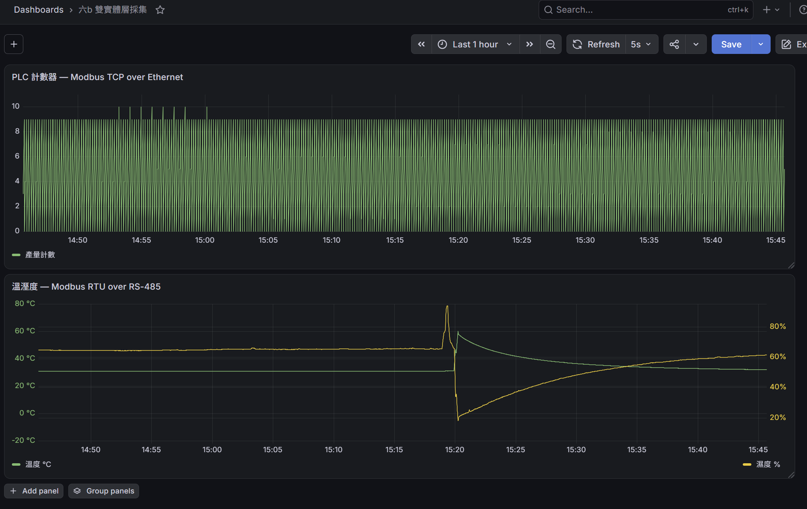

**實務上的意義**：這 8 次是運氣。**瞬時事件靠輪詢抓不到**——要抓就得在 PLC 端鎖存（latch），讓那個值撐到上位機來讀為止。輪詢週期決定了你看得見什麼，而不是設備發生了什麼。

</details>

<details>
<summary><b>斷線注入測試</b></summary>

手動停掉 Runtime 再重啟：

- 斷線期間存下 6 筆 `quality = 0`，**節奏維持 0.99–1.01 秒**
- Runtime 回來後**自動重連**，不需重啟採集程式
- **啟動順序無關**：先開 `collect.py` 再開 Runtime 也接得住

⚠️ `pymodbus` 的預設逾時是 **3 秒**，而採集週期是 1 秒。**逾時必須小於取樣週期**，否則設備一斷線，單次讀取就會卡住三個週期。

### ⚠️ 這一段原本的結論是錯的（2026-09-17 更正）

原文寫「節奏維持 0.99–1.01 秒，證明 `timeout=0.5` 生效」。**兩個地方都錯：**

**一、`timeout` 從來沒有生效過。** `ModbusTcpClient` 還有一個沒人注意的參數 `retries`，**預設 3**。單次讀取的最壞情況不是 `timeout`，是：

```
timeout × (1 + retries) = 0.5 × 4 = 2.0 秒
```

設 0.5 秒，實際封頂 2 秒——**比取樣週期長兩倍**。改成 `timeout=0.8, retries=0` 之後，最大單次讀取從 2002 ms 降到 488 ms，`LOOP LATE` 與 `transaction_id` 錯配同時歸零。

> 補充：`transaction_id` 錯配的成因是 **timeout 本身**，不是 `retries`。逾時到了程式放棄，**但 PLC 沒有放棄**——遲到的回覆躺在接收緩衝區裡，下一輪先撿到它。`retries` 只是把次數放大。

**二、這個測試根本沒走到逾時那條路。** 把 Runtime 整個停掉，對方是**主動拒絕連線**（`connection refused`），那是瞬間回應。

> **真正的「對方在、但不回」從來沒測過。兩種失效模式，只測了一種。**

**規則改寫**：`timeout × (1 + retries)` 必須小於取樣週期。**這條規則後來直接決定了 RS-485 的參數**（`timeout=0.3, retries=0`）和 `rtu_scan.py` 可不可行。

後續在樹莓派上補做了完整的故障注入（拔線、對方在但不回、PLC 按下 Stop、儲存層寫入停頓、重開機），並因此找到一個更嚴重的缺陷：**程式每秒都在「重連」，卻從來沒有真的重連過**——`connect()` 看到手上還有那條死掉的舊連線，就直接回答「已連線」。修正是先 `close()` 再 `connect()`。

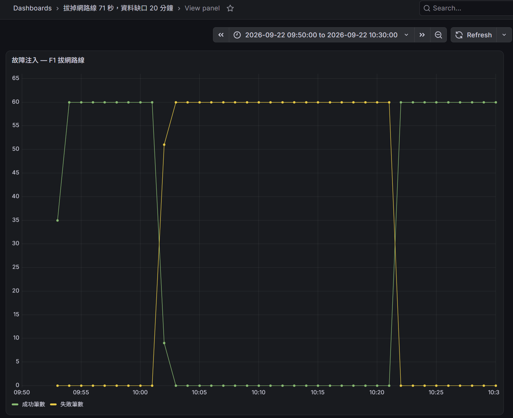
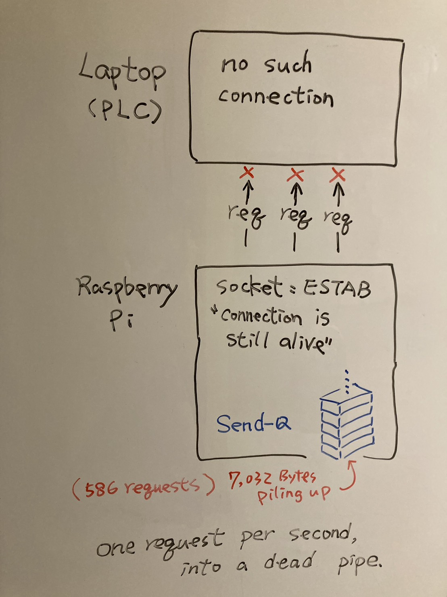

> **這個缺陷，8 小時乾淨長跑完全看不出來。只有刻意拔線才找得到。**

### 「啟動順序無關」為什麼重要

**停電復電時，gateway 和 PLC 同時開機。** 誰先起來完全不由你決定——開機速度、韌體、網路交握，每次都不一樣。

如果採集程式要求「PLC 必須先在」，那**每次跳電之後它都會死，而且是在沒有人在場的時候。**

</details>

<details>
<summary><b>雙向控制：位址探測與命令回饋</b></summary>

### 先探測，不猜

`probe.py` 找出哪些位址讀得到，`write_test.py` 找出寫進去留不留得住：

```
addr     1 : 寫入 ok    立刻讀= 4321   2 秒後= 4321     ✅ 留得住
addr   100 : 寫入 ok    立刻讀= 4321   2 秒後= 4321     ✅ 留得住
addr  1024 : 寫入 ok    立刻讀=    0   2 秒後=    0     ❌ 回報成功，值卻沒進去
```

**「兩秒後再讀一次」是必要的**——PLC 每 20 ms 掃描一次，如果那個位址是 PLC 的輸出，寫進去的值會在下一個掃描週期被蓋掉。兩秒 ≈ 100 個掃描週期，撐過就不是僥倖。

**位址 1024 那一列**：Modbus 回應「寫入成功」，值根本沒存進去。**協定層說「我收到了」，跟系統說「我做了」，是兩件事。**

### 把 PV 接上外部變數之後，PLC 癱瘓了

第一版把計數器的 `PV` 直接接 `count_limit`。開機讀到十行 **0**——`count_limit` 開機是 0 → `CV >= PV` 立刻成立 → 回授到 `R` → **每個掃描週期重置一次，每秒被歸零五十次。**

**一台原本能自己運作的 PLC，被改成沒有上位機就癱瘓的機器。**

> 不是因為技術上做不到遠端控制——五分鐘就做到了。
> **是因為做到之後，就多了一個會讓產線停擺的單點故障。**

### `LIMIT` 的四項驗收

| 上位機寫入 | PLC 實際使用 | 結果 |
|---|---|---|
| 沒寫（開機 = 0） | 10 | ✅ 自己會動 |
| 500 | 500 | ✅ |
| **0** | **10** | ✅ 不癱瘓 |
| **40000**（超出 INT 上限） | **10** | ✅ 沒亂跑 |

### 40000 和 -25536 是同一組 16 個位元

| | 型別 | 看到的值 |
|---|---|---|
| Modbus 暫存器 | 16 bit **無號** | `40000` |
| PLC 的 `INT` | 16 bit **有號** | **`-25536`** |

沒有任何轉換發生，同樣的位元、兩種解讀。`LIMIT` 擋下的其實是一個負數，不是四萬。

**型別不是格式，是「這串位元要怎麼讀」的約定。**

> 同一件事在 RS-485 那邊又出現一次：XY-MD02 的溫度是**有號** 16 位元，濕度是**無號**。不做二補數轉換的話，冬天的 −5.0 °C 會讀成 **6548.6 °C**——而且不會報錯。所以 `signed` 寫在 `devices.toml` 裡，每個 tag 各自宣告。

</details>

<details>
<summary><b>兩個語言的逐行對照</b></summary>

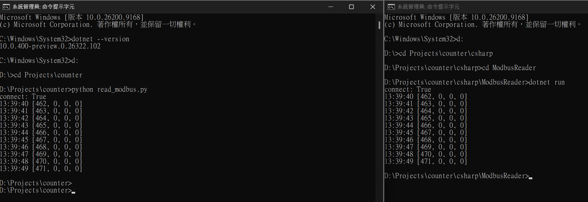

兩個終端機同時執行，**時間戳對齊、數值十比十完全相同**。

**兩支程式同時連上同一個 slave**——Modbus TCP 允許多個 client 並行讀取，這順帶驗證了採集端可以在不干擾既有連線的情況下加入。

> ⚠️ **這件事在 RS-485 上做不到，而且作業系統會阻止你做。** 序列埠有獨占旗標，第二支程式連 `connect()` 都過不了。**半雙工匯流排上同時有兩個 master 會直接碰撞**——TCP 的「多個 client 無害」是乙太網路給的特權，不是 Modbus 給的。

| 做什麼 | Python（pymodbus） | C#（NModbus） |
|---|---|---|
| 建連線 | `ModbusTcpClient(host, port=5020)` | `new TcpClient()` + `Connect()` |
| 建 Modbus 層 | 內建在 client 物件裡 | `new ModbusFactory().CreateMaster(client)` |
| slave id | 預設 `1`，可不寫 | **必須明寫** |
| 逾時 | `timeout=0.5`（秒） | `Transport.ReadTimeout = 500`（毫秒） |
| 錯誤處理 | `isError()` — **回傳值** | `try / catch` — **擲出例外** |
| 關閉連線 | `client.close()` | `using var` — 自動 |
| 依賴宣告 | `requirements.txt`（環境層級） | `.csproj`（專案層級） |

### 為什麼刻意寫兩遍

不是為了展示會兩種語言，是為了**讓差異浮出來**。

只用過一套函式庫的時候，會分不清哪些是「**協定的規定**」、哪些只是「**這套函式庫幫你做的決定**」。

寫第二遍才發現：slave id 是協定的一部分（pymodbus 幫你填了預設值），而「錯誤用回傳值還是用例外」完全是語言慣例、跟協定無關。

**還有一個實務後果**：`isError()` 你可以忘記檢查，例外你不能忘記接。**在採集程式裡，「安靜地寫錯」比「直接掛掉」危險得多。**

> 諷刺的是，pymodbus 自己兩種都用：**從站拒絕**用回傳值，**從站沒回應**用例外。見「Modbus RTU」那一節。

</details>

<details>
<summary><b>Grafana：踩坑與「設定即程式碼」</b></summary>

**1. 時間欄的單位是「秒」，不是毫秒。**

Grafana 內建 SQL 資料源的慣例是毫秒，**這個外掛不是**。寫成 `ts * 1000` 的後果是圖照畫、不報錯、**時間軸顯示 1952 年**。

**2. `Format as` 要跟查詢的形狀一致。**

`Time series` 需要一個時間欄；只有兩個數字欄的查詢必須設成 `Table`，否則報 `can not convert to wide series`。

> ⚠️ **`Format as` 是查詢的輸出格式，跟面板的視覺化類型是兩個不同的下拉選單。** 兩者不一致的症狀是一個大數字蓋在波形上（`Stat` 面板吃了 time series 的資料）。

**3. `Max data points` 預設會降採樣。**

Grafana 會把資料點壓到跟螢幕寬度差不多，也就是把幾十筆平均成一筆。**看趨勢時是體貼，看抖動時是破壞**——本專案的雙峰分布會被整個抹平。要看分布必須手動調高（設 50000）。

### 雙來源同圖：兩條線、兩個 Y 軸

溫度 20–30，計數器 0–10，畫在同一個 Y 軸上溫度會把計數器壓成一條貼著底的平線。用 **field override** 把第二條線指到右軸，兩條線才都看得見。

**這才是把兩種設備接進同一個資料庫的理由**：以後要問「設備異常跟環境溫溼度有沒有關係」，兩邊的值必須有**共同的時間基準**才有得比。分開存兩個檔案，對齊時間戳就變成另一個工程問題。

### 儀表板進版控

`dashboard.json` 是儀表板的完整定義：有幾張圖、每張跑什麼 SQL、畫成點還是線、`Max data points` 設多少。

- **搬家**：換一台機器 import 就長回來
- **版控**：純文字，改了什麼看 diff 就知道
- **交付**：文件附這個檔，讀者得到跟作者一模一樣的畫面

**一台 gateway 可以用滑鼠設定，五十台不行。**

時區設成 **UTC**、時間範圍用**絕對時間**，這樣換誰在哪個時區打開都一樣。

> ⚠️ Grafana 13 匯出的是 `dashboard.grafana.app/v2` schema，**舊版可能無法匯入**。

> ⚠️ **匯出時要打開「給另一個執行個體使用」**。一般的匯出會把這台機器的資料來源識別碼、時間範圍、時區一起寫死——搬到另一台匯入之後，圖全是空的（實際發生過）。**設定即程式碼要成立，設定裡就不能綁死環境。**

</details>

<details>
<summary><b>環境與 Runtime 的兩處出廠設定</b></summary>

| 項目 | 版本 |
|---|---|
| OpenPLC Editor / Runtime | 4.2.11 / 4.2.1 |
| Python | 3.11+（`tomllib` 需要）、pymodbus 3.15.0、pyserial 3.5 |
| Gateway 硬體 | Raspberry Pi 5 / 8GB，Raspberry Pi OS，microSD（UHS-I SDR104） |
| RS-485 | USB 轉 RS-485 模組（`/dev/ttyUSB0`）、XY-MD02 溫溼度計 |
| .NET SDK / NModbus | 10.0.400-preview / 3.0.83 |
| Grafana / SQLite 外掛 | 筆電 OSS 13.2.1、樹莓派 OSS 13.2.2 / frser-sqlite-datasource 4.0.6 |
| OS | Windows 11 |

### Runtime 出廠設定不會讓 Modbus 動起來

| 檔案 | 改什麼 | 為什麼 |
|---|---|---|
| `plugins.conf` | `modbus_slave` 的 enabled 欄 `0` → `1` | 出廠預設停用 |
| `simple_modbus.py`（約第 982 行） | `gIp` → `"0.0.0.0"` | 出廠值是安裝當下機器的 IP，換網路就綁不上 |

⚠️ **`plugins.conf` 的修改會被 Editor 無聲覆蓋**——Editor 一連上 Runtime 就會推送它自己的外掛設定。**改這個檔之前必須先關掉 Editor。**

固定流程：`關 Editor → 改 plugins.conf → 重啟 Runtime → netstat 確認 5020`。

### RS-485 那一端

- **帳號必須在 `dialout` 群組**，否則 `/dev/ttyUSB0` 開不起來。加完要**重新登入**才生效
- XY-MD02 的**量測值在 0x04 輸入暫存器**（0x0001 溫度、0x0002 濕度，值 ÷ 10），**設定值在 0x03 保持暫存器**（0x0101 鮑率、0x0104 裝置位址）。**兩者是不同的位址空間，不是同一份資料的兩種讀法**
- 感測器供電 DC 5–30 V、< 0.2 W，可直接從轉換模組的 5V 取電
- 最高支援 19200 bps

### 執行時的注意事項

- **關掉 Windows 主控台的「快速編輯模式」**——在終端機視窗裡用滑鼠選取文字會把程序整個暫停，實測造成過一次 **66 秒**的停擺
- **用 `python collect.py` 執行，不要只打 `collect.py`**——副檔名關聯會把它開進編輯器而不是執行它

</details>

---

## 進度

| | 狀態 |
|---|---|
| 軟 PLC 梯形圖 | ✅ |
| Python 讀取（Modbus TCP） | ✅ |
| C# 對照版 | ✅ |
| SQLite 落地 + 完整性驗證 | ✅ |
| Grafana 儀表板 | ✅ |
| 雙向讀寫 + 命令範圍檢查 | ✅ |
| **搬上樹莓派，跨越真實網路** | ✅ |
| **故障注入（五種失效模式）** | ✅ |
| **Modbus RTU over RS-485** | ✅ |
| **組態驅動：設備清單與程式碼分離** | ✅ |
| **三層告警規則，跑在 edge 端** | ⬜ |
| **MQTT 上送雲端（Edge-to-Cloud）** | ⬜ |

**2026-09-27 更新**：樹莓派這一段結案。

- **有線直連驗收**：8.06 小時 / 29,023 筆 / 零讀取失敗 / 最大單次讀取 < 200 ms
- **取樣間隔抖動 < 0.1 ms**——對照筆電上的 ±13.8 ms 雙峰，**同一支程式、同一段 SQL、同一份 `dashboard.json`，換一台機器，分布形狀完全不同**
- **五種故障注入全數完成**，並在過程中找到「重連從未真的重連」（見「斷線注入測試」）
- **無人值守重開機**：服務自己起來，缺口 24 秒、零失敗
- **Grafana 裝在 gateway 上**，`dashboard.json` 改為可攜匯出

⚠️ **一條驗收標準因架構定案而失效**：原本寫「斷網十分鐘再接回來，這十分鐘的資料還在」，但本專案把 PLC 留在網路另一端，**斷網等於斷資料源**，那十分鐘的值從來不存在。替代條款是「斷線期間每秒如實記錄 `q=0`、路一通 1 秒內自動恢復」，兩條都已達成。原本的要求移到 RS-485（資料源變成本機）與 MQTT 上送（上行的斷線緩衝）。

> **驗收標準跟程式碼一樣會過期。架構一改，前面訂的每一條都要重新讀一遍——而這件事沒有人會提醒你做。**

---

**2026-10-01 更新**：RS-485 這一段結案。同一台 gateway 現在同時走兩種實體層。

- **雙來源長跑驗收**：14.80 小時 / 159,843 筆 / **零讀取失敗**（三個 tag 各 53,281 筆）
- **RS-485 單次交易 31 ms**，佔 1 秒週期的 3.2%——序列輪詢兩個設備完全來得及
- **六種故障的症狀對照表全部實測**，結論是「**四種病因、一個症狀**」（見 Modbus RTU 一節）
- **`collect.py` 改為組態驅動**：設備、暫存器、換算、逾時全搬進 `devices.toml`。驗收標準是**在程式碼裡 grep 不到任何設備專屬字串**
- **`rtu_scan.py`**：掃鮑率 × 同位 × 位址找出不認識的從站。可行性完全由 timeout 決定——**照預設值要 49 分鐘，量過 31 ms 之後設 0.15 秒，變成 2 分鐘**
- **Grafana 雙來源面板**：計數器與溫度同圖、兩個 Y 軸
- **找到第四個發現**：零失敗率是真的，但**少了 15 輪**，而那 15 輪在資料庫裡一列都沒有

> 這一段最值得記的不是「RS-485 接起來了」。
> 是**把設備清單從程式碼裡搬出去之後，`collect.py` 才真的成為一支 gateway 程式**——在那之前它只是一支「會讀那台 PLC 的程式」。

---

## 尚未解開的問題

### 一、Windows 上那 16 ms 的間距是誰造成的

**發現 2 的雙峰分布，成因還沒找到。**

已用隔離測試排除：迴圈節奏、`time.sleep` 粒度、時鐘精度、系統排程 tick。**僅剩 Modbus 讀取與 SQLite 寫入兩個候選**——雙峰只在這兩者都在迴圈裡時出現。

下一步的測法是二分：`timer_test.py` 只加 SQLite，再只加 Modbus。四分鐘就能定案。

**新的線索（2026-09-27 驗證）**：同一支程式搬到樹莓派、走有線之後，**雙峰消失了**。

一開始的直方圖只剩一根長條，這本身可疑——**可能只是把間隔四捨五入到毫秒造成的假象**。把分組從 1 ms 細化到 0.01 ms 重畫之後確認不是：

| 取樣間隔 | 筆數 |
|---|---|
| 1000.02 – 1000.04 ms | 12 |
| 1000.05 ms | 399 |
| **1000.06 ms** | **25,070（86.4%）** |
| 1000.07 ms | 3,377 |
| 1000.08 – 1000.12 ms | 164 |

**單峰、右偏，全距 0.1 ms。** 對照 Windows 上兩峰相距 16 ms，**差了 160 倍**。

右偏是合理的：**延遲只會讓它變慢，不會讓它變快。** 一個對稱的鐘形分布反而可疑。

⚠️ **但這只是換掉了問題，不是解決它。** 現在要問的不再是「為什麼有雙峰」，而是「**Windows 上那 16 ms 的間距是誰造成的**」——答案仍然不知道，只是確定了它是那個平台特有的現象。

**沒有繼續追，是因為事先設了停損。** 同一類問題，前一次追了四天；這次講好「兩輪測試、每輪兩分鐘，不管結果如何都收」，總共花十分鐘。

> **設停損不是放棄，是把「查到為止」換成「查到約定的深度為止」。**
> 前者聽起來比較負責，實際上是把時間交給運氣。

### 二、那 8,170 毫秒的寫入停頓，是誰造成的

14.8 小時裡只有一次，12 秒內連續四發，`read` 全程正常，慢的全在 `write`（見「發現 4」）。

**已經排除的：**

| 懷疑 | 怎麼排除 |
|---|---|
| 系統排程（`logrotate`、`apt`、`fstrim`、`man-db`） | 五個排程的時間全部查過，**沒有一個落在 01:35** |
| 核心 I/O 錯誤 | `dmesg` 全程**零** mmc 相關錯誤 |
| journald 自己掛了 | `/var/log/journal` 存在，當晚 20:00–08:00 共 865 行，**確實在工作** |
| 網路或 PLC 那端 | `read=62ms` 正常，而且 RS-485 跟網路無關 |

**最符合證據的解釋**：`lsblk` 顯示 `mmcblk0p2`、`TRAN=mmc`，`dmesg` 是 `mmc0: new UHS-I speed SDR104 SDXC card`——**這是 SD 卡，不是 eMMC**（兩者都掛在 `mmcblk`，要靠 `dmesg` 的速度模式才分得出來：`SDXC` + `UHS-I` 是 SD 卡，`MMC card` + `HS200/HS400` 才是 eMMC）。消費級 SD 卡的控制器會自己做垃圾回收與抹寫平衡，**期間對上層完全不回應，而且不會回報任何錯誤**。

⚠️ **這是推測，不是證明。** `journalctl` 在那 12 秒**完全沒有紀錄**（`-- No entries --`），所以沒有任何直接證據。要證實需要換 SSD 或 eMMC 再跑一次同樣的 14 小時，比對同一個現象還在不在。

> **我事先預測過這次長跑的 `LOOP LATE` 會落在五個系統排程的哪一個。五個全錯。**
> 事件發生在 01:35，不在 21:29、00:00、00:08、00:43、06:52 的任何一個。
> **能排除五個嫌疑人，跟找到兇手，是兩件事。**

**這個問題比第一個重要**，因為它直接造成資料缺口，而不只是抖動。下一階段要做的「補 `quality=0`」是在**處理後果**——真正的成因還在那裡。
